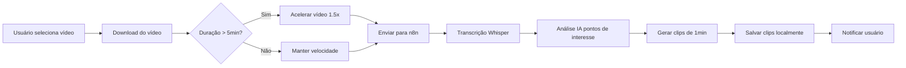

# 🎬 Clipper - Cortador Inteligente de Vídeos

[](https://dotnet.microsoft.com/)
[](https://angular.io/)
[](https://www.typescriptlang.org/)
[](LICENSE)

> Sistema local para automatizar a criação de clips de 1 minuto dos melhores momentos de vídeos do YouTube e Twitch usando IA.

## 🚀 Funcionalidades

- **📺 Dashboard de Canais**: Interface limpa para gerenciar canais do YouTube e Twitch
- **🤖 Processamento com IA**: Identificação automática dos melhores momentos usando Whisper + GPT
- **✂️ Geração de Clips**: Cortes inteligentes de 1 minuto com fallback para cortes aleatórios
- **⚡ Tempo Real**: Acompanhamento do progresso via SignalR
- **🔄 Automação**: Jobs em background para sincronização e limpeza
- **📱 Interface Responsiva**: Dashboard moderno construído com Angular Material

## 🏗️ Arquitetura

### Stack Tecnológica
```
Frontend:  Angular 17+ + Angular Material + SignalR
Backend:   ASP.NET Core 8 + Entity Framework + Hangfire
Database:  SQLite (local)
IA:        n8n + Whisper + GPT-4
APIs:      YouTube Data API v3 + Twitch Helix API
```

### Estrutura do Projeto
```
📁 Clipper/
├── 📄 docs/              # Documentação completa
├── 🔧 src/
│   ├── Clipper.Domain/         # Entidades e interfaces
│   ├── Clipper.Application/    # Services e DTOs
│   ├── Clipper.Infrastructure/ # EF Core, APIs externas
│   ├── Clipper.API/           # Controllers e middlewares
│   └── clipper-web/           # Angular SPA
├── 🧪 tests/             # Testes unitários e integração
└── 🐳 docker/            # Containerização
```

## 📋 Documentação

| Documento | Descrição |
|-----------|-----------|
| [📋 Projeto Detalhado](docs/PROJETO_DETALHADO.md) | Épicos, cronograma e critérios de aceite |
| [📝 Backlog de Tarefas](docs/BACKLOG_TAREFAS.md) | Sprint planning e definition of done |
| [🏛️ Arquitetura Técnica](docs/ARQUITETURA_TECNICA.md) | Stack, camadas e estrutura de dados |
| [🔌 Especificação de APIs](docs/API_SPECIFICATION.md) | Contratos de API e webhooks |
| [✅ Checklist de Implementação](docs/CHECKLIST_IMPLEMENTACAO.md) | Guia prático de desenvolvimento |
| [📊 Status de Implementação](docs/STATUS_IMPLEMENTACAO.md) | Acompanhamento do progresso atual |

## 🚦 Status do Projeto

```
🎯 FASE ATUAL: Planejamento Completo ✅
📅 PRÓXIMA FASE: Setup e Fundações
⏱️ DURAÇÃO ESTIMADA: 8 semanas
🎯 MVP TARGET: Sistema funcional end-to-end
```

### Progresso por Épico

| Épico | Status | Progresso |
|-------|--------|-----------|
| 🔧 Setup Inicial | 📋 Planejado | `████░░░░░░` 40% |
| 🗄️ Domínio e Dados | 📋 Planejado | `██░░░░░░░░` 20% |
| 🔌 Integrações | 📋 Planejado | `░░░░░░░░░░` 0% |
| 🎥 Processamento IA | 📋 Planejado | `░░░░░░░░░░` 0% |
| 🖥️ Interface Web | 📋 Planejado | `░░░░░░░░░░` 0% |
| 🔄 Automação | 📋 Planejado | `░░░░░░░░░░` 0% |
| 🧪 Testes | 📋 Planejado | `░░░░░░░░░░` 0% |
| 🚀 Deploy | 📋 Planejado | `░░░░░░░░░░` 0% |

## 🔧 Instalação e Configuração

### Pré-requisitos

- **.NET 8 SDK** - [Download](https://dotnet.microsoft.com/download)
- **Node.js 18+** - [Download](https://nodejs.org/)
- **Angular CLI** - `npm install -g @angular/cli`
- **yt-dlp** - [Instalação](https://github.com/yt-dlp/yt-dlp)
- **n8n Instance** - Para processamento de IA

### Setup Rápido

```bash
# 1. Clonar o repositório
git clone https://github.com/seu-usuario/clipper.git
cd clipper

# 2. Backend (.NET)
cd src/Clipper.API
dotnet restore
dotnet ef database update
dotnet run

# 3. Frontend (Angular) - em outro terminal
cd src/clipper-web
npm install
ng serve

# 4. Acessar aplicação
# Backend: http://localhost:5000
# Frontend: http://localhost:4200
```

### Configuração de APIs

```json
// appsettings.json
{
  "YouTube": {
    "ApiKey": "your-youtube-api-key"
  },
  "Twitch": {
    "ClientId": "your-twitch-client-id",
    "ClientSecret": "your-twitch-client-secret"
  },
  "N8n": {
    "BaseUrl": "https://your-n8n-instance.com",
    "WebhookSecret": "your-webhook-secret"
  }
}
```

## 🎯 Como Usar

### 1. Cadastrar Canal
```
Dashboard → "Adicionar Canal" → Cole URL do YouTube/Twitch → Salvar
```

### 2. Processar Vídeo
```
Canal Card → "Cortar Vídeo" → Aguardar processamento → Visualizar clips
```

### 3. Gerenciar Clips
```
Vídeo → "Ver Clips" → Preview → Download individual ou em lote
```

## 🔄 Fluxo de Processamento



## 🧪 Testes

```bash
# Backend
dotnet test

# Frontend
ng test
ng e2e

# Cobertura
dotnet test --collect:"XPlat Code Coverage"
```

## 🚀 Deploy

### Docker Compose
```bash
docker-compose up -d
```

### Manual
```bash
# Build backend
dotnet publish -c Release -o ./publish

# Build frontend
ng build --configuration production

# Deploy para servidor
```

## 🤝 Contribuição

1. Fork o projeto
2. Crie uma branch para sua feature (`git checkout -b feature/nova-feature`)
3. Commit suas mudanças (`git commit -m 'feat: adicionar nova feature'`)
4. Push para a branch (`git push origin feature/nova-feature`)
5. Abra um Pull Request

### Padrões de Commit
- `feat:` Nova funcionalidade
- `fix:` Correção de bug
- `docs:` Documentação
- `refactor:` Refatoração
- `test:` Testes

## 📊 Roadmap

### v1.0 (MVP) - 8 semanas
- [x] Documentação completa
- [ ] Sistema básico funcionando
- [ ] Processamento com IA
- [ ] Interface web responsiva

### v1.1 - Melhorias
- [ ] Agendamento automático
- [ ] Exportação com legendas
- [ ] Métricas de engajamento
- [ ] API pública

### v2.0 - Expansão
- [ ] Suporte a mais plataformas
- [ ] Processamento em lote
- [ ] Análise de sentimentos
- [ ] Machine learning próprio

## 🐛 Issues Conhecidos

- [ ] Rate limiting das APIs externas
- [ ] Processamento lento para vídeos longos
- [ ] Dependência de conexão com n8n

## 📄 Licença

Este projeto está sob a licença MIT. Veja o arquivo [LICENSE](LICENSE) para detalhes.

## 👥 Time

- **Desenvolvedor Principal**: [Seu Nome]
- **Arquitetura**: Clean Architecture + DDD
- **Metodologia**: Scrum com sprints de 1 semana

## 📞 Suporte

- **Issues**: [GitHub Issues](https://github.com/seu-usuario/clipper/issues)
- **Documentação**: Pasta `/docs` neste repositório
- **Discord**: [Link do servidor] (futuro)

---

<p align="center">
  <i>Desenvolvido com ❤️ para automatizar a criação de conteúdo</i>
</p>

<p align="center">
  
  
  
</p>
