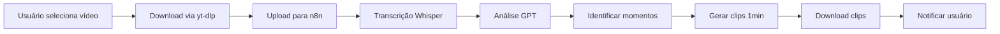

# 🎬 Clipper - AI-Powered Video Clipper

> Sistema inteligente para criação automática de clips de 1 minuto a partir de vídeos do YouTube e Twitch

[](https://dotnet.microsoft.com/)
[](https://angular.io/)
[](LICENSE)
[](https://github.com/rodrigomj87/Clipper/issues)

## 🚀 **Visão Geral**

O **Clipper** é uma aplicação local que automatiza a criação de clips virais a partir de vídeos longos do YouTube e Twitch. Utilizando IA (Whisper + GPT), o sistema identifica os melhores momentos e gera clips de 1 minuto prontos para compartilhamento.

### **✨ Principais Features**
- 🎥 **Download automático** de vídeos do YouTube/Twitch
- 🧠 **Análise por IA** para identificar momentos virais
- ✂️ **Criação automática** de clips de 1 minuto
- 📊 **Dashboard** em tempo real com progresso
- 💾 **Storage local** para privacidade total
- 🔄 **Background processing** com filas

## 🏗️ **Arquitetura**

### **Tech Stack**
- **Backend**: ASP.NET Core 8 + Clean Architecture
- **Frontend**: Angular 17+ + Material Design
- **Database**: SQLite (local) + Entity Framework Core
- **AI Pipeline**: n8n + Whisper + GPT
- **Real-time**: SignalR
- **Background Jobs**: Hangfire

### **Estrutura do Projeto**
```
src/
├── Clipper.API/          # 🌐 Controllers e API endpoints
├── Clipper.Application/  # 📋 Services e lógica de negócio
├── Clipper.Domain/       # 🏗️ Entidades e interfaces
├── Clipper.Infrastructure/ # 🔧 EF Core, repositórios e integrações
├── Clipper.Common/       # 🛠️ Helpers e configurações
└── Clipper.Tests/        # 🧪 Testes unitários e integração

docs/                     # 📚 Documentação técnica
.github/                  # 🔄 Templates e configurações
```

## 🎯 **Project Management**

### **📋 GitHub Issues & Projects**
Este projeto utiliza **GitHub Issues** e **GitHub Projects** para organização completa:

- 📋 **Issues**: Épicos, features, bugs e tasks organizadas
- 🎯 **Project Board**: [@rodrigomj87's Clipper](https://github.com/users/rodrigomj87/projects)
- 🏷️ **Labels**: Sistema organizado por tipo, componente e prioridade
- 📊 **Milestones**: Sprint planning com story points

### **🚀 Sprints Organizados**

#### **Sprint 1: Foundation** (21 pts) - 2-3 semanas
- ✅ Solution setup e arquitetura
- 🔄 Entity Framework configuration (#13)
- 🔄 API básica e estrutura
- **Milestone**: [#10](https://github.com/rodrigomj87/Clipper/issues/10)

#### **Sprint 2: Core Features** (34 pts) - 3-4 semanas
- 📋 CRUD completo (Channels, Videos, Clips)
- 🔐 Sistema de autenticação
- 🎨 Dashboard Angular
- 📊 Relatórios básicos
- **Milestone**: [#11](https://github.com/rodrigomj87/Clipper/issues/11)

#### **Sprint 3: AI Integration** (55 pts) - 4-5 semanas
- 🤖 Integração YouTube/Twitch APIs
- 🧠 Pipeline de IA (Whisper + GPT)
- 🔄 Background processing
- 📡 Real-time updates
- **Milestone**: [#12](https://github.com/rodrigomj87/Clipper/issues/12)

## 🛠️ **Quick Start**

### **Pré-requisitos**
- .NET 8 SDK
- Node.js 18+
- Angular CLI 17+
- Git

### **Instalação**
```bash
# Clone o repositório
git clone https://github.com/rodrigomj87/Clipper.git
cd Clipper

# Backend
cd src/Clipper.API
dotnet restore
dotnet run

# Frontend (em outro terminal)
cd frontend
npm install
ng serve
```

### **URLs de Desenvolvimento**
- 🌐 **API**: https://localhost:7001
- 🎨 **Frontend**: https://localhost:4200
- 📊 **Swagger**: https://localhost:7001/swagger

## 📊 **Status Atual**

### **✅ Completado**
- [x] Documentação técnica completa
- [x] Solução .NET com Clean Architecture
- [x] GitHub repository setup
- [x] Issue templates e workflow

### **🔄 Em Progresso** 
- [ ] Entity Framework configuration ([#13](https://github.com/rodrigomj87/Clipper/issues/13))
- [ ] Domain entities setup
- [ ] Infrastructure layer

### **📈 Métricas**
- **Issues Total**: 13 criadas
- **Épicos**: 9 (CLIP-001 a CLIP-009)
- **Milestones**: 3 sprints organizados
- **Progress**: Sprint 1 iniciado

## 🤝 **Como Contribuir**

### **Workflow Organizado**
1. 🔍 **Veja issues com label** `ready-for-dev`
2. 🎯 **Escolha uma task** e se auto-atribua
3. 🌿 **Crie branch**: `feature/CLIP-XXX-description`
4. 💻 **Desenvolva** seguindo Clean Architecture
5. 📝 **Abra PR** linkando à issue
6. ✅ **Review e merge**

### **Issue Templates Disponíveis**
- 🐛 **Bug Report**: Para reportar problemas
- ✨ **Feature Request**: Para sugerir melhorias
- 🔧 **Task**: Para tarefas técnicas de desenvolvimento

### **Sistema de Labels**
- **Tipo**: `epic`, `feature`, `bug`, `task`
- **Componente**: `backend`, `frontend`, `database`, `ai-integration`
- **Status**: `ready-for-dev`, `in-progress`, `needs-review`
- **Prioridade**: `critical`, `high`, `medium`, `low`

## 📚 **Documentação Completa**

### **📋 Planejamento**
- [📋 Projeto Detalhado](docs/PROJETO_DETALHADO.md)
- [📝 Backlog de Tarefas](docs/BACKLOG_TAREFAS.md)
- [🔧 GitHub Config](.github/PROJECT_CONFIG.md)

### **🏗️ Técnica**
- [🏛️ Arquitetura](docs/ARQUITETURA_TECNICA.md)
- [📖 API Specification](docs/API_SPECIFICATION.md)
- [✅ Checklist de Implementação](docs/CHECKLIST_IMPLEMENTACAO.md)

### **📊 Acompanhamento**
- [📊 Status de Implementação](docs/STATUS_IMPLEMENTACAO.md)
- [🎯 Project Board](https://github.com/users/rodrigomj87/projects)

## 🔧 **Stack Técnica Detalhada**

### **Backend (.NET 8)**
```
📦 Clipper.Domain         → Entidades, Value Objects, Interfaces
📦 Clipper.Application    → Services, DTOs, Mappers, Validators  
📦 Clipper.Infrastructure → EF Core, Repositories, External APIs
📦 Clipper.API           → Controllers, Middlewares, Filters
📦 Clipper.Common        → Extensions, Helpers, Configurations
📦 Clipper.Tests         → Unit & Integration Tests
```

### **Tecnologias Integradas**
- **ORM**: Entity Framework Core 8
- **Real-time**: SignalR
- **Background Jobs**: Hangfire
- **Validation**: FluentValidation
- **Mapping**: AutoMapper
- **Testing**: xUnit + Moq
- **Documentation**: Swagger/OpenAPI

## 🎬 **Fluxo de Processamento de Vídeo**



## 📄 **License**

Este projeto está licenciado sob a MIT License - veja o arquivo [LICENSE](LICENSE) para detalhes.

## 🔗 **Links Importantes**

- 🐙 **Repository**: [rodrigomj87/Clipper](https://github.com/rodrigomj87/Clipper)
- 📋 **Issues**: [GitHub Issues](https://github.com/rodrigomj87/Clipper/issues)
- 🎯 **Project Board**: [@rodrigomj87's Projects](https://github.com/users/rodrigomj87/projects)
- 📚 **Docs**: [docs/](docs/)

---

## 🎯 **Próximos Passos**

1. **Implementar EF Core** ([#13](https://github.com/rodrigomj87/Clipper/issues/13))
2. **Configurar entities** e migrations
3. **Desenvolver API base** (CRUD)
4. **Setup Angular** project
5. **Integrar real-time** updates

---

**🚀 Ready to Code!** 

> Sistema organizado, documentado e pronto para desenvolvimento colaborativo.

Para começar, veja as [issues ready-for-dev](https://github.com/rodrigomj87/Clipper/labels/ready-for-dev) ou a [documentação técnica](docs/)